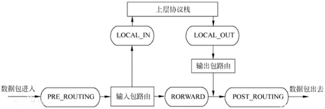
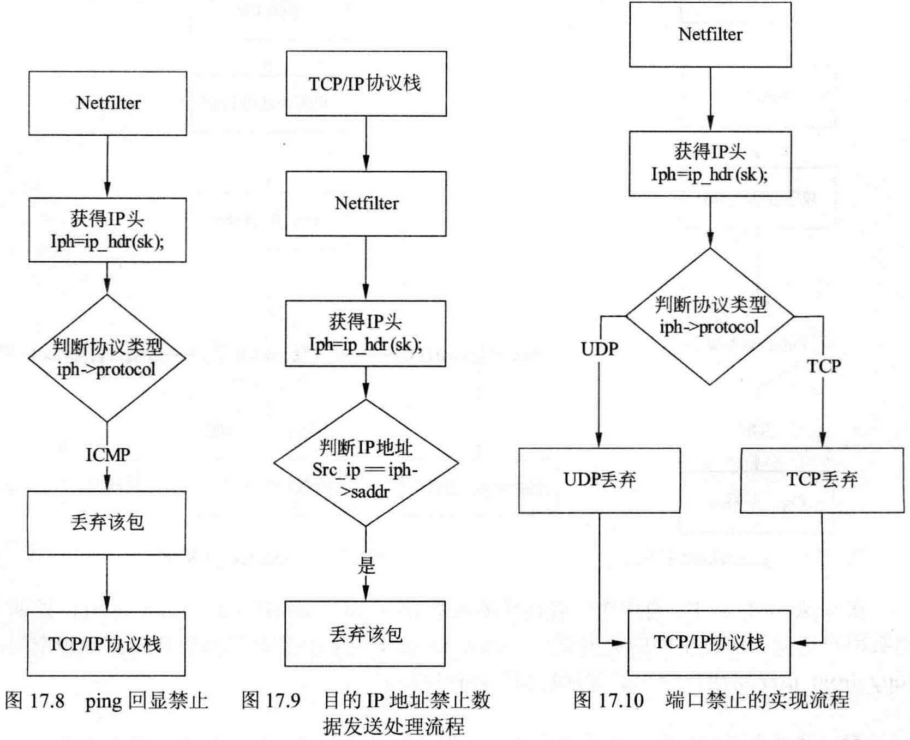
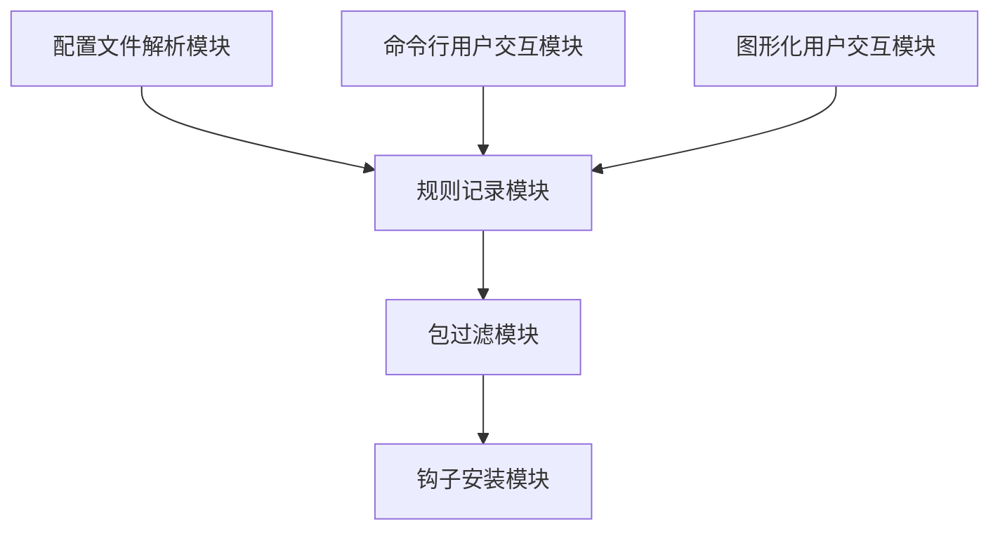
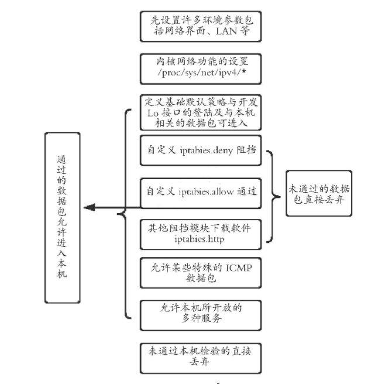

# 个人防火墙设计与开发

## 项目开发原理

### Netfilter

Netfilter是Linux内核中的一个数据包处理模块，它可以提供数据包的过滤、转发、地址转换NAT功能。Iptables是一个工具，可以用来在 Netfilter中增加、修改、删除数据包处理规则。

Netfilter是位于网卡和内核协议栈之间的一堵墙，是一种免费的软件防火墙。

Netfilter中有三个主要的概念：规则、表、链，等级依次递增。

- 规则是对特定报文的处理说明，包括匹配字段和 action。 
- 链是一组规则的集合。 
- 表是链中相同功能的规则集合。 



### 规则

#### 链

链可以看作网卡和内核协议栈之前的多道关卡，对于不同类型的报文，走不同的关卡进行处理，即匹配不同的链。

- 由网卡上送到内核协议栈的报文：PREROUTING -> INPUT 
- 由网卡出来不能上送到内核协议栈的报文：PREROUTING -> FORWARD -> POSTROUTING 
- 由内核协议栈送往网卡的报文：OUTPUT -> POSTROUTING 

#### 表

为了管理方便，链中相同功能的规则被组织在了一张表中，iptables已经为我们定义了四张表。

表的优先级次序（由高到低）：raw -> mangle -> nat -> filter

**filter表**

主要用于对数据包进行过滤，根据具体的规则决定是否放行该数据包（如DROP、ACCEPT、REJECT、LOG）。filter 表对应的内核模块为iptable_filter，包含三个规则链：

- `INPUT`链：INPUT针对那些目的地是本地的包
- `FORWARD`链：FORWARD过滤所有不是本地产生的并且目的地不是本地(即本机只是负责转发)的包
- `OUTPUT`链：OUTPUT是用来过滤所有本地生成的包

**nat表**

主要用于修改数据包的IP地址、端口号等信息（网络地址转换，如SNAT、DNAT、MASQUERADE、REDIRECT）。属于一个流的包(因为包
的大小限制导致数据可能会被分成多个数据包)只会经过这个表一次。如果第一个包被允许做NAT或Masqueraded，那么余下的包都会自动地被做相同的操作，也就是说，余下的包不会再通过这个表。表对应的内核模块为 iptable_nat，包含三个链：

- `PREROUTING`链：作用是在包刚刚到达防火墙时改变它的目的地址
- `OUTPUT`链：改变本地产生的包的目的地址
- `POSTROUTING`链：在包就要离开防火墙之前改变其源地址

**mangle表**

主要用于修改数据包的TOS（Type Of Service，服务类型）、TTL（Time To Live，生存周期）指以及为数据包设置Mark标记，以实现Qos(Quality Of Service，服务质量)调整以及策略路由等应用，由于需要相应的路由设备支持，因此应用并不广泛。包含五个规则链——PREROUTING，POSTROUTING，INPUT，OUTPUT，FORWARD。

**raw表**

是自1.2.9以后版本的iptables新增的表，主要用于决定数据包是否被状态跟踪机制处理。在匹配数据包时，raw表的规则要优先于其他表。包含两条规则链——OUTPUT、PREROUTING

iptables中数据包和4种被跟踪连接的4种不同状态：

- `NEW`：该包想要开始一个连接（重新连接或将连接重定向）
- `RELATED`：该包是属于某个已经建立的连接所建立的新连接。例如：FTP的数据传输连接就是控制连接所 RELATED出来的连接。`--icmp-type 0` ( ping 应答) 就是`--icmp-type 8` (ping 请求)所RELATED出来的。
- `ESTABLISHED` ：只要发送并接到应答，一个数据连接从NEW变为ESTABLISHED,而且该状态会继续匹配这个连接的后续数据包。
- `INVALID`：数据包不能被识别属于哪个连接或没有任何状态比如内存溢出，收到不知属于哪个连接的ICMP错误信息，一般应该DROP这个状态的任何数据。

#### 表链关系

一张链中可以有多张表，但是不一定拥有全部的表。

数据包的处理是根据链来进行的，但是实际的使用过程中，是通过表来作为操作入口，来对规则进行定义的。

### iptables

#### iptables介绍

linux的包过滤功能，即linux防火墙，它由netfilter 和 iptables 两个组件组成。 

netfilter 组件也称为内核空间，是内核的一部分，由一些信息包过滤表组成，这些表包含内核用来控制信息包过滤处理的规则集。 

iptables 组件是一种工具，也称为用户空间，它使插入、修改和除去信息包过滤表中的规则变得容易。

#### iptables基础

我们知道iptables是按照规则来办事的，规则其实就是网络管理员预定义的条件，规则一般的定义为”如果数据包头符合这样的条件，就这样处理这个数据包”。规则存储在内核空间的信息包过滤表中，这些规则分别指定了源地址、目的地址、传输协议（如TCP、UDP、ICMP）和服务类型（如HTTP、FTP和SMTP）等。当数据包与规则匹配时，iptables就根据规则所定义的方法来处理这些数据包，如放（accept）、拒绝（reject）和丢弃（drop）等。配置防火墙的主要工作就是添加、修改和删除这些规则。

当客户端访问服务器的web服务时，客户端发送报文到网卡，而tcp/ip协议栈是属于内核的一部分，所以，客户端的信息会通过内核的TCP协议传输到用户空间中的web服务中，而此时，客户端报文的目标终点为web服务所监听的套接字（IP：Port）上，当web服务需要响应客户端请求时，web服务发出的响应报文的目标终点则为客户端，这个时候，web服务所监听的IP与端口反而变成了原点，我们说过，netfilter才是真正的防火墙，它是内核的一部分，所以，如果我们想要防火墙能够达到”防火”的目的，则需要在内核中设置关卡，所有进出的报文都要通过这些关卡，经过检查后，符合放行条件的才能放行，符合阻拦条件的则需要被阻止，于是，就出现了input关卡和output关卡，而这些关卡在iptables中不被称为”关卡”,而被称为”链”。 

## 软件设计

### 软件模块划分

#### 配置文件解析模块

读取用户编写的配置生成对应规则。

#### 命令行用户交互模块

提供命令行交互式的规则增删功能。

#### 图形化用户交互模块

提供图形化的规则增删功能。

#### 规则记录模块

中间层。存储规则。

#### 钩子安装模块

实现主要防火墙功能。

#### 包过滤模块

实现钩子函数，根据用户定义的规则决定网络包是否被过滤。





### 软件流程图



## 开发环境搭建

安装 Rocky8 并安装所需软件包

```bash
dnf install kernel-headers-`uname -r` kernel-devel-`uname -r` gcc-c++ make elfutils-libelf-devel
```

## 软件编译与安装

```bash
make
make install
```

## 软件卸载

```bash
make remove
```

## 软件用法说明

该防火墙主要提供三个功能——ip封禁、端口封禁、子网封禁。

### 命令行接口 pfw_cli 使用说明

pfw_cli 即 Personal Firewall CLI —— 简易个人防火墙规则管理命令行接口

```
usage: pfw_cli <command> <args><command>:
        list    列出当前所有规则
        clear   清除所有规则
        block-ip [ip地址列表]   增加规则：拦截目的地址在列表中的所有包
        block-port [端口列表]   增加规则：拦截目的端口在列表中的所有包
        block-subnet [子网列表] 增加规则：禁止访问列表中的子网（子网格式形如<ip地址>/<网络号>，如192.168.1.0/24）
        allow-ip [ip地址列表]   移除规则：不再拦截目的地址在列表中的包
        allow-port [端口列表]   移除规则：不再拦截目的端口在列表中的包
        allow-subnet [子网列表] 移除规则：不再禁止访问列表中的子网（子网格式形如<ip地址>/<网络号>，如192.168.1.0/24）
```

### 内核模块 API 说明

所有交互都以读写 `/proc/personal_firewall` 文件的形式进行。


#### 读取目前规则

参考 src/module/main.h

```c
#define RULE_BANIP     0x00
#define RULE_BANPORT   0x01
#define RULE_BANSUBNET 0x02
```

读取 /proc/personal_firewall

一行三个正整数。

第一个整数表示规则说明

例：

`1 8270`

表示该机封禁了 20000 号端口

#### 修改规则

参考 src/module/main.h

```c
#define FIREWALL_RULE_CLEAR         0
#define FIREWALL_RULE_ADD_IP        1
#define FIREWALL_RULE_ADD_PORT      2
#define FIREWALL_RULE_REMOVE_IP     3
#define FIREWALL_RULE_REMOVE_PORT   4
#define FIREWALL_RULE_ADD_SUBNET    5
#define FIREWALL_RULE_REMOVE_SUBNET 6
```

写入 /proc/personal_firewall

写入形式为，若干个正整数，中间以空格分隔

第一个正整数表示功能，第二第三个为参数。

- FIREWALL_RULE_CLEAR 清除所有规则
- FIREWALL_RULE_ADD_IP 添加封禁ip，第二个值为ip（32位无符号整数）
- FIREWALL_RULE_ADD_PORT 添加封禁ip，第二个值为port （16位无符号整数）
- FIREWALL_RULE_REMOVE_IP 移除封禁ip，第二个值为ip
- FIREWALL_RULE_REMOVE_PORT 移除封禁ip，第二个值为port
- FIREWALL_RULE_ADD_SUBNET 添加封禁子网，第二个整数为ip，第三个整数为mask
- FIREWALL_RULE_REMOVE_SUBNET 移除封禁子网，第二个整数为ip，第三个整数为mask

例如想要封禁端口 20000， 可以通过命令 `echo "2 8270" > /proc/personal_firewall`

此时输入 `cat /proc/personal_firewall`，因该能看到“1 8270 0”